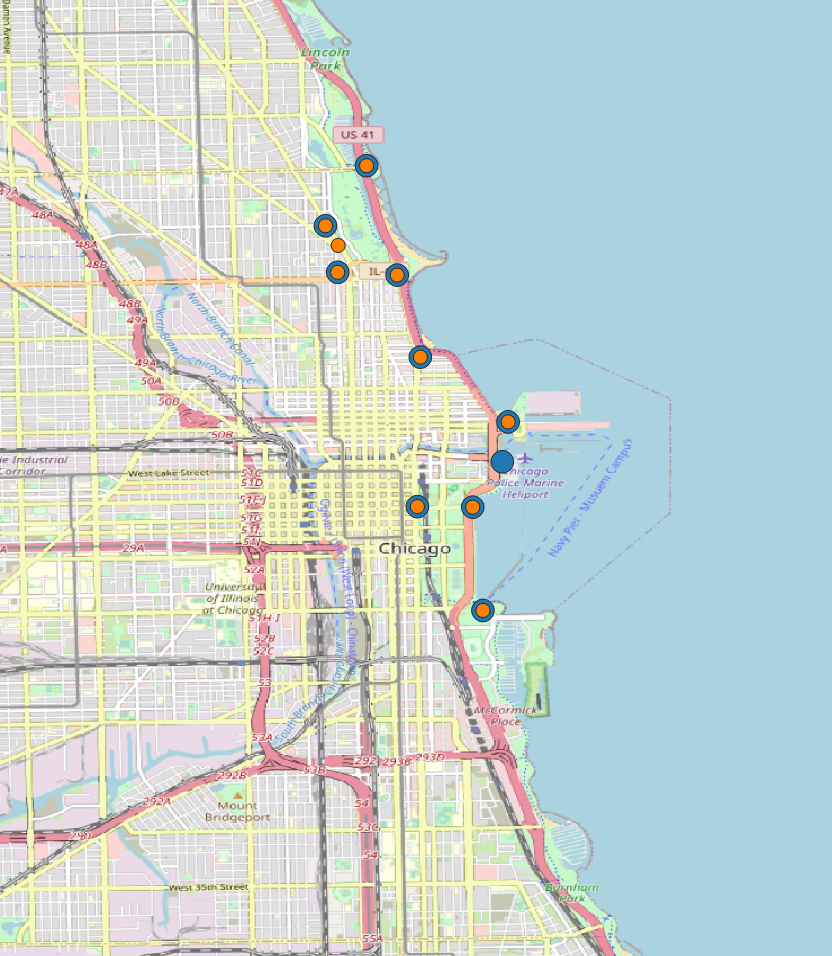
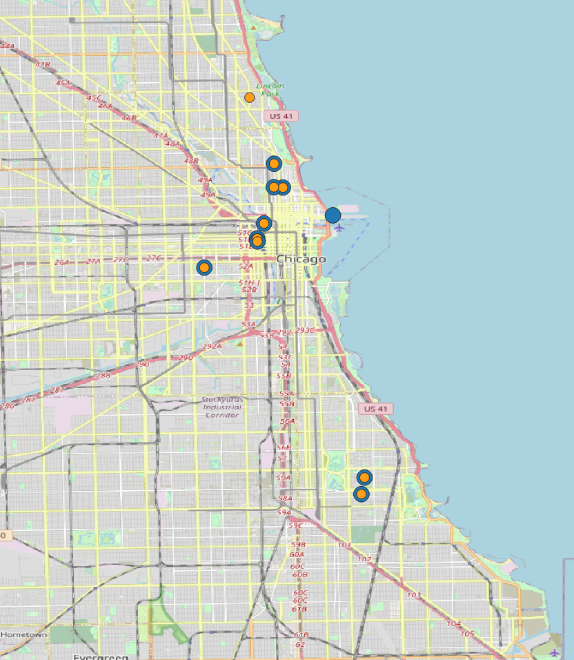
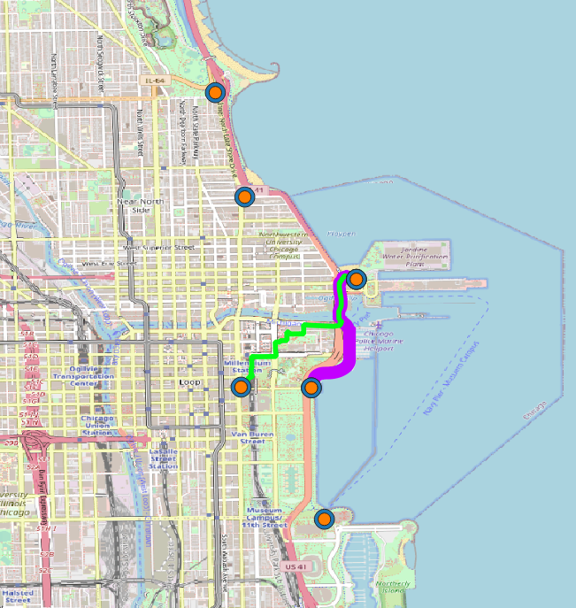
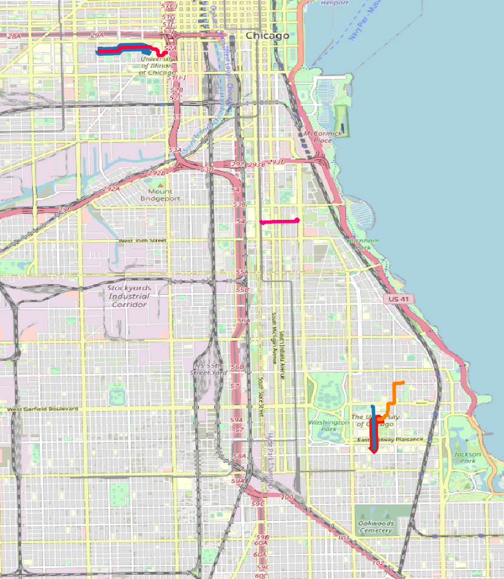

# Analysis of the Chicago rides data for 2022 of the Divvy Bikes bike sharing company 

## Task

Analyze the ride data to come up with insights and recommendations for a marketing campaign aimed at converting non-member riders to members.

## Data used

The [divvy-tripdata](https://divvy-tripdata.s3.amazonaws.com/index.html) for 2022.

## Data cleaning

1. 12 folders were downloaded for every month of 2022. The csv files were extracted from their folder and the folders were deleted with the following python script: 

<details>
  <summary>file extraction script</summary>

```python

import os
import shutil

# set the path to the parent directory where the folders are located
parent_dir = "."

# loop through each folder in the parent directory
for folder_name in os.listdir(parent_dir):

    # create the path for each folder in the parent folder
    folder_path = os.path.join(parent_dir, folder_name)
    
    # check if the item is a directory, if it is not a folder, it skips it
    if os.path.isdir(folder_path):

        # loop through each file in the folder
        for file_name in os.listdir(folder_path):

            # create the path of the element in the subfolder
            file_path = os.path.join(folder_path, file_name)

            # if the element in the subfolder is another folder, the folder is deleted
            if os.path.isdir(file_path):
                 shutil.rmtree(file_path)
            else:
                # otherwise, if it is a file, the file is moved to the parent directory
                shutil.move(file_path, os.path.join(parent_dir, file_name))
                
            # delete the now-empty subfolder
        shutil.rmtree(folder_path)
        
```

</details>
    
2. The headers of each csv file were extracted to a csv file with the following python script to make sure that they each had the same headers and especially the same header length:

<details>
  <summary>headers extraction script</summary>

```python
import csv
import os

# set the path to the parent directory where the files are located
parent_dir = "."

# set the name of the file to which the headers will be extracted
headers_file = "headers.csv"

# initialize the headers list
headers = []

# loop through each file in the parent directory
for file_name in os.listdir(parent_dir):
    file_path = os.path.join(parent_dir, file_name)
    
    # check if the item is a file and ends with .csv
    if os.path.isfile(file_path) and file_name.endswith(".csv"):
        
        # open the file and read the first row
        with open(file_path, "r") as csv_file:
            csv_reader = csv.reader(csv_file)
            row = next(csv_reader)
            
            # add the row to the headers list
            headers.append(row)
            
# write the headers to the headers file
with open(headers_file, "w", newline="") as csv_file:
    csv_writer = csv.writer(csv_file)
    csv_writer.writerows(headers)
```

</details>
    
3. Once it was confirmed that the layout was the same for every file, the 12 files were merged into one single file with the following R script:

<details>
  <summary>file merging script</summary>
  
```r
# Obtain the working directory
work_dir <- getwd()

# set the file names of the CSV files to be merged
csv_files <- c("202201-divvy-tripdata.csv",
               "202202-divvy-tripdata.csv",
               "202203-divvy-tripdata.csv",
               "202204-divvy-tripdata.csv",
               "202205-divvy-tripdata.csv",
               "202206-divvy-tripdata.csv",
               "202207-divvy-tripdata.csv",
               "202208-divvy-tripdata.csv",
               "202209-divvy-tripdata.csv",
               "202210-divvy-tripdata.csv",
               "202211-divvy-tripdata.csv",
               "202212-divvy-tripdata.csv")

# create an empty data frame to store the merged data
merged_data <- data.frame()

# loop through each CSV file and merge the data into the merged_data data frame
for (file in csv_files) {

  # create the file path by concatenating the working directory and the file name
  file_path <- file.path(work_dir, file)
  
  # load the data from the CSV file
  data <- read.csv(file_path)

  # print the number of rows of the loaded data to verify if the number makes sense
  # and hence if the read was successful
  print(nrow(data))

  # merge the data into the final data frame
  merged_data <- rbind(merged_data, data)
}

# print the total number of rows of the data frame containing the data from
# each file
print(nrow(merged_data))

# write the dataframe of the merged data to a csv file
write.csv(merged_data, "merged_data.csv", row.names = FALSE)

```
  
</details>

The dataset contained a total of 5 667 717 rows.

4. Riders can start and end rides at two different types of locations: at stations where bikes are locked into a dock, and designated areas where bikes can be taken and left without being docked. The positions of the designated areas are not provided and since it is an area, the coordinates of where the bikes are either left or taken varies. This brought challenges and, as a result, only rides that started and ended at a station were used in the project. 

This translated into removing every row that contained null attributes.

This filtering was done throught the following R script:

<details>
  <summary>null filtering script</summary>

```r
# load the full dataset into a dataframe
data <- read.csv("merged_data.csv")

# show the head of the dataframe to verify that the read was successful
head(data)

# remove entries that have null values
# this function turned out to be insufficient and did not remove
# all of the rows with empty attribute values
data_without_na <- na.omit(data)


# removing rows where either the start or end station value was
# an empty string completely eliminated rows with null values
data_without_na <- data_without_na[data_without_na$end_station_name != "", ]
data_without_na <- data_without_na[data_without_na$start_station_name != "", ]

# print the number of rows of the datafram for information
print(nrow(data_without_na))

# write the filtered and cleaned dataframe to a csv file
write.csv(data_without_na, "data_without_nulls.csv", row.names = FALSE)

```

</details>

This reduced the dataset to 4 369 360 rows.

5. The dataset was then divided between rides in which the user is a member and rides in which the user is not a member. It was done with the following R script:

<details>
  <summary>separating customer type script</summary>
  
```r
  
library(dplyr)

data <- read.csv("data_without_nulls.csv")

casual_rows <- data[data$member_casual == "casual", ]

write.csv(casual_rows, "data_casual.csv", row.names = FALSE)

member_rows <- data[data$member_casual == "member", ]

write.csv(member_rows, "data_member.csv", row.names = FALSE)
               
```
  
</details>

## Data analysis

### 10 most popular start and end stations

- for non-members
  
  <details>
    <summary>start stations</summary>

  | station_name | start_lat | start_lng | ride_count |
  | ----- | ----- | ----- | ----- |
  | Streeter Dr & Grand Ave | 41.89228 | -87.61204 | 55061 |
  | DuSable Lake Shore Dr & Monroe St | 41.88096 | -87.61674 | 30262 |
  | Millennium Park | 41.88103 | -87.62408 | 23951 |
  | Michigan Ave & Oak St | 41.90087 | -87.62369 | 23761 |
  | DuSable Lake Shore Dr & North Blvd | 41.91176 | -87.62676 | 22157 |
  | Shedd Aquarium | 41.86725 | -87.61538 | 19421 |
  | Theater on the Lake | 41.92628 | -87.63083 | 17333 |
  | Wells St & Concord Ln | 41.91213 | -87.63466 | 14834 |
  | Dusable Harbor | 41.88698 | -87.61281 | 13271 |
  | Clark St & Armitage Ave | 41.91831 | -87.63628 | 12779 |

  </details>

  <details>
    <summary>end stations</summary>
     
  | station_name | start_lat | start_lng | ride_count |
  | ----- | ----- | ----- | ----- |
  | Streeter Dr & Grand Ave | 41.89228 | -87.61204 | 57810 |
  | DuSable Lake Shore Dr & Monroe St | 41.88096 | -87.61674 | 28543 |
  | Millennium Park | 41.88103 | -87.62408 | 25676 |
  | Michigan Ave & Oak St | 41.90087 | -87.62369 | 25373 |
  | DuSable Lake Shore Dr & North Blvd | 41.91176 | -87.62676 | 25305 |
  | Theater on the Lake | 41.92628 | -87.63083 | 18649 |
  | Shedd Aquarium | 41.86725 | -87.61538 | 18047 |
  | Wells St & Concord Ln | 41.91213 | -87.63466 | 14416 |
  | Clark St & Armitage Ave | 41.91831 | -87.63628 | 13030 |
  | Clark St & Lincoln Ave | 41.91569 | -87.6346 | 12852 |

  </details>

  <details>
    <summary>map (done in QGIS)</summary>

  start stations in blue & end stations in orange

  

  </details>

- for members

  <details>
    <summary>start stations</summary>

  | station_name | start_lat | start_lng | ride_count |
  | ----- | ----- | ----- | ----- |
  | Kingsbury St & Kinzie St | 41.88918 | -87.63851 | 23523 |
  | Clark St & Elm St | 41.90297 | -87.63128 | 20581 |
  | Wells St & Concord Ln | 41.91213 | -87.63466 | 19674 |
  | Clinton St & Washington Blvd | 41.88338 | -87.64117 | 18828 |
  | Loomis St & Lexington St | 41.87219 | -87.6615 | 18252 |
  | Clinton St & Madison St | 41.88223 | -87.64106 | 18007 |
  | University Ave & 57th St | 41.79148 | -87.59986 | 17581 |
  | Ellis Ave & 60th St | 41.7851 | -87.60107 | 17504 |
  | Wells St & Elm St | 41.90311 | -87.63475 | 17496 |
  | Streeter Dr & Grand Ave | 41.89228 | -87.61204 | 16208 |

  </details>

  <details>
    <summary>end stations</summary>

  | station_name | start_lat | start_lng | ride_count |
  | ----- | ----- | ----- | ----- |
  | Kingsbury St & Kinzie St | 41.88918 | -87.63851 | 23213 |
  | Clark St & Elm St | 41.90297 | -87.63128 | 20902 |
  | Wells St & Concord Ln | 41.91213 | -87.63466 | 20272 |
  | Clinton St & Washington Blvd | 41.88338 | -87.64117 | 19496 |
  | Clinton St & Madison St | 41.88223 | -87.64106 | 18520 |
  | University Ave & 57th St | 41.79148 | -87.59986 | 18439 |
  | Loomis St & Lexington St | 41.87219 | -87.6615 | 18065 |
  | Wells St & Elm St | 41.90311 | -87.63475 | 17466 |
  | Ellis Ave & 60th St | 41.7851 | -87.60107 | 17319 |
  | Broadway & Barry Ave | 41.93758 | -87.6441 | 16506 |

  </details>

  <details>
    <summary>map (done in QGIS)</summary>
    
    start stations in blue & end stations in orange
  
    

  </details>

### Discussion

The overall count of rides for each station of the top 10, and the whole top 10, represent a very small fraction of the total number of rides. It therefore does not provide a very reliable picture of the overall use of the service, by both categories.

However, the distinction between members and non members appear to indicate that non-members may be more interested in tourism and sightseeing as stations are located closer to the water and in park areas. 

### 10 most popular itineraries

- for non-members

  <details>
    <summary>list of itineraries</summary>

  | start_station_name | end_station_name | ride_count |
  | ----- | ----- | ----- |
  | Streeter Dr & Grand Ave | Streeter Dr & Grand Ave | 10632 |
  | DuSable Lake Shore Dr & Monroe St | DuSable Lake Shore Dr & Monroe St | 6615 |
  | DuSable Lake Shore Dr & Monroe St | Streeter Dr & Grand Ave | 5100 |
  | Michigan Ave & Oak St | Michigan Ave & Oak St | 4612 |
  | Millennium Park | Millennium Park | 4061 |
  | Montrose Harbor | Montrose Harbor | 2939 |
  | Streeter Dr & Grand Ave | DuSable Lake Shore Dr & Monroe St | 2854 |
  | Streeter Dr & Grand Ave | Millennium Park | 2735 |
  | Shedd Aquarium | Shedd Aquarium | 2479 |
  | DuSable Lake Shore Dr & North Blvd | DuSable Lake Shore Dr & North Blvd | 2439 |

  </details>

  <details>
    <summary>map (done in QGIS with TravelTime plugin)</summary>

  start stations in blue & end stations in orange

  

  </details>

- for members

  <details>
    <summary>list of itineraries</summary>

  | start_station_name | end_station_name | ride_count |
  | ----- | ----- | ----- |
  | Ellis Ave & 60th St | University Ave & 57th St | 5848 |
  | University Ave & 57th St | Ellis Ave & 60th St | 5544 |
  | Ellis Ave & 60th St | Ellis Ave & 55th St | 5278 |
  | Ellis Ave & 55th St | Ellis Ave & 60th St | 4745 |
  | State St & 33rd St | Calumet Ave & 33rd St | 3268 |
  | Calumet Ave & 33rd St | State St & 33rd St | 3215 |
  | Loomis St & Lexington St | Morgan St & Polk St | 2891 |
  | Morgan St & Polk St | Loomis St & Lexington St | 2876 |
  | University Ave & 57th St | Kimbark Ave & 53rd St | 2267 |
  | Loomis St & Lexington St | Halsted St & Polk St | 2091 |

  </details>

  <details>
    <summary>map (done in QGIS with TravelTime plugin)</summary>

  

  </details>

### Discussion

For non-members, the fact that the start and end station is often the same indicates a desire to "roam around", which itself points towards sightseeing and tourism. This raises doubt that the two itineraries displayed on the map, showing the most direct path between the start and end station, are representative of the real itineraray of riders.

For members, the fact that a start and end station combination is also present inverted in the list, in many cases, shows a commutting pattern. This indicates that the most direct path between the start and end station is likely to be representative of the real itinerary of riders.

## Final Discussion

Upon reflection, the business task only required to analyze the data related to non-members because the goal was to enthize non-members to become members. Therefore, only insights related to non-members were needed.

The analysis performed suggests that there is a group of non-users interested in sightseeing and tourism.

## Recommendation

Offer membership benefits related to sightseeing and tourism.

This would be especially relevant if the company had bike networks in many cities in the US and/or arround the world.
