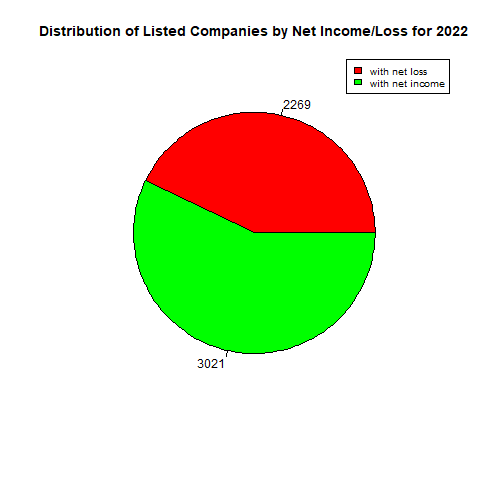

# Analysis report
## Task

Identify the number of American listed companies with a net income and the companies with a net loss for the fiscal year 2022.

## Data used

Financial Statement Data Sets for the first quarter of 2023 on the U.S. Securities Aand Exchange Commission's [website](https://www.sec.gov/dera/data/financial-statement-data-sets).

the file containing the financial data, called ```num.txt```, converted to a csv format, was used for the analysis. 

## Data cleaning

One value has been collected from the financial data file:
- NetIncomeLoss

This entry may not be used by every company. Other entries such as ```ProfitLoss``` might have been used to designate the net income/loss. Companies that used other entries were excluded from this analysis.

This entry also takes into the account exceptionnal incomes such as the revenues resulting from asset liquidations.

<details>
  <summary>Cleaning done in R</summary>

```r
library(tidyr)

# Import of the file containing all numeric values in submitted documents to the SEC.
raw_data = read.csv('num.csv',sep = ',')

# Cleaning data
# Only keeping the NetIncomeLoss values because this is the chosen metric in this case
raw_data <- subset(raw_data, tag == "NetIncomeLoss")

# Remove entries where coregistrants are mentioned to only deal with consolidated data
raw_data <- subset(raw_data, coreg == "")

# We only keep entries related to an annual report
raw_data <- subset(raw_data, qtrs == 4)

# We only keep information for the end of year 2022
raw_data <- subset(raw_data, ddate == "20221231")

# Rotate table so that NetIncomeLoss for each entries are now columns 
rotated_data <- pivot_wider(raw_data, names_from = tag, values_from = value)

# Obtain the total number of companies that submitted financial statements to the SEC in 2022
unique_adsh_raw <- unique(rotated_data$adsh)

# We only keep entries for which the NetIncomeLoss are above 0
# These are companies that made money in the year
rotated_data <- subset(rotated_data, NetIncomeLoss > 0)

# Obtain the total number of companies that made a profit in 2022
unique_adsh_clean <- unique(rotated_data$adsh)

#### Data visualization ####

# Give the pie chart a file name
png(file = "net_income_loss_2022.jpg")

# labels for the pie chart
labels <- c("with net loss", "with net income")

# The values for each entry. That is cies that lost money in the year and cies that made money in the year
values <- c(length(unique_adsh_raw) - length(unique_adsh_clean), length(unique_adsh_clean))

# Colors of the chart slices
colors <- c("red", "green")

# the pie chart
pie(values, labels = values, radius = 0.75, col = colors, main = "Distribution of Listed Companies by Net Income/Loss for 2022")

# the legend of the pie chart
legend("topright", labels, cex = 0.8, fill = colors)

# saving the pie chart to a file
dev.off()
```
</details>
  
## Data analysis

- 5 290 companies having used the ```NetIncomeLoss``` were identified
- 3 021 of those had a net income
- 2 269 of those had a net loss

  
  
## Conclusion
  
The proportion of companies that had a net income surprised me. I expected a much lower proportion of companies with a net income compared to those with a net loss. It would be interesting to look at the companies that had a net operating income versus those that had a net operating loss. Perhaps the proporition of companies with a net income would be much lower compared to those with a net loss.
